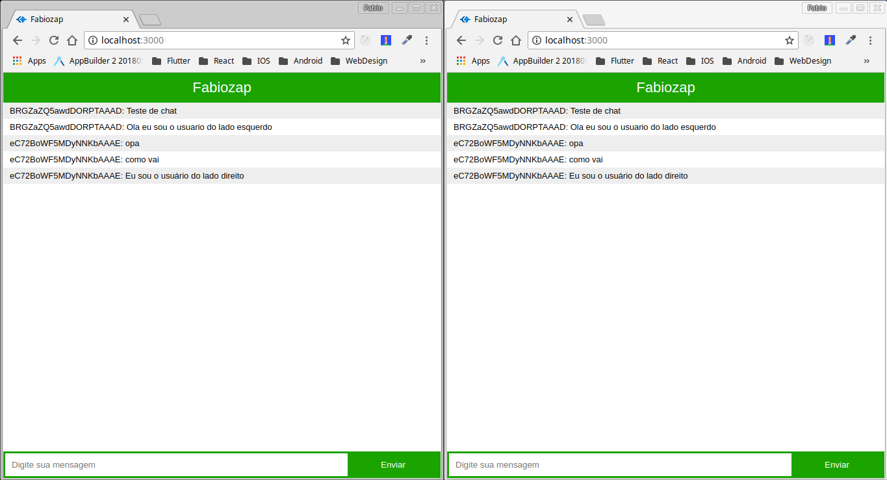

# Node Exemplos de Chat com WebSocket

Neste exemplo foi utilizado a biblioteca socket.io para criar a comunicação, foi também adicionado um arquivo html para fazer troca de mensagem.

### Rodando o projeto

Para iniciar o projeto certifique-se de que já tem o Node.js instalado em seu sistema, após isso faça os comando a seguir que tudo dará certo.

1. Abra a pasta do projeto no terminal e logo faça:

```
npm install
```

2. Aguarde finalizar o processo e faça:

```
node app.js
```
